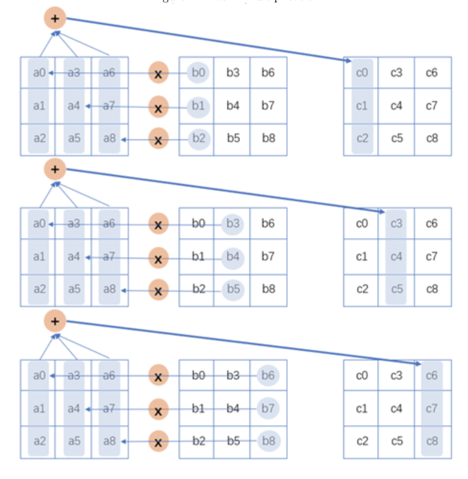

# DGEMM in Rust

Input matrices are column major

### System
Processor: 2.3 GHz Quad-Core Intel Core i7

Memory: 16 GB 3733 MHz LPDDR4X

## Strategy

### Block Multiply
* Breaks matrices into blocks that fit into l1 cache
* Copies matrices into column major and row major respectively for optimal access pattern
* Performs normal 3 loop once we are inside a small block
* Optimizes for block size 4096
* Achieve ~4x performance improvement
* [Performance report](./benchmark_report/block_vs_naive.pdf)

### Block Multiply + Algorithm Optimization
* Uses the following addition scheme. The algorithm accesses columns of all 3 matrices sequentially, enabling us to contiguously access memory for column major matrices. 

* [Performance report](./benchmark_report/block_vs_naive_vs_blas.pdf)

## Tools
#### [criterion](https://github.com/bheisler/criterion.rs)

#### OpenBlas 
* Installed with homebrew
* Manually set the following
  * export LDFLAGS="-L/usr/local/opt/openblas/lib"
  * export RUSTFLAGS="-C link-args=$LDFLAGS"
  * OPENBLAS_NUM_THREADS to desired number of threads
* Used same build optimization as this repo https://github.com/bluss/matrixmultiply/blob/master/blas-bench/build.rs

